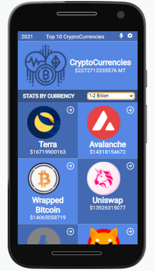
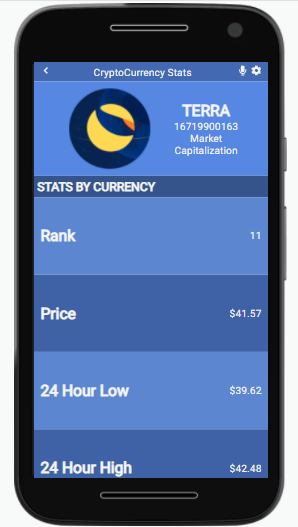
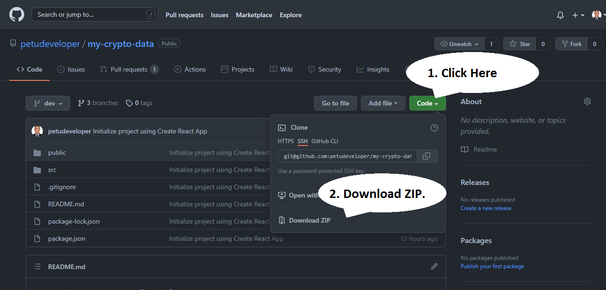

# My Crypto Data

If you are a fan of cryptocurrencies this web application is for you. This web app displays the total market capitalization of the top 20 cryptocurrencies in the world. You can filter the currencies by range or select one to get more information.

## Built With

- REACT
- REACT-REDUX

# Screenshots

## Live Demo

You can see my live demo here:
[Check it out!(TBA)](URL)

## Getting Started

-You can clone the repo by using this commands on your terminal: 
> - `git clone https://github.com/petudeveloper/my-crypto-data.git`.
> - `cd my-crypto-data`.

-You can also download this repo as a ZIP file following this instructions:
>

-To run tests `npm test`.

👤 **David Alvarez**

- GitHub: [@petudeveloper](https://github.com/petudeveloper)
- Twitter: [@petudeveloper](https://twitter.com/petudeveloper)
- LinkedIn: [David Alvarez Mazzo](https://www.linkedin.com/in/davidalvarezmazzo/)

## Acknowledgment
Original design idea by Nelson Sakwa on Behance.

## Show your support

Give a ⭐️ if you like this project!
